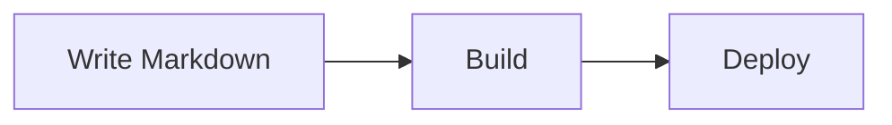

<div align="center">

<picture>
  <source media="(prefers-color-scheme: dark)" srcset="public/tbj-white-logo.png">
  
</picture>

# The Brian Journal

**A personal blog by [Brian Castelino](https://github.com/bcastelino)** — writing about technology, building things, and various topics.

[](https://bcastelino.github.io/blogs/)
[](https://github.com/bcastelino/blogs/actions/workflows/deploy.yml)
[](./LICENSE)


</div>

---

## ✨ Features

- **Static-first** — fully exported with Next.js `output: 'export'`; no server required
- **Light / dark theming** via an OKLCH design-token system with no theme flash
- **Markdown posts** compiled at build time with `remark` + `remark-gfm`
- **Mermaid diagrams** rendered client-side from fenced code blocks
- **Docs page** with sidebar navigation and a Markdown reference
- **Reading experience** with copy-code buttons, reading time, and "keep reading" suggestions
- **Automatic deploys** to GitHub Pages on every push to `main`

## 🧰 Stack

| Area | Technology |
| --- | --- |
| Framework | **Next.js 15** (App Router, static export) |
| UI | **React 19**, **CSS Modules**, OKLCH tokens |
| Fonts | **Geist** + **Geist Mono** via `next/font` |
| Content | **Markdown** via `remark`, `remark-gfm`, `remark-html`, `gray-matter` |
| Diagrams | **Mermaid 11** + `@mermaid-js/layout-elk` |
| Hosting | **GitHub Pages** + **GitHub Actions** |

## 🚀 Local development

```bash
npm install
npm run dev
```

Open <http://localhost:3000>. (Locally there is no `/blogs` base path; that is only
applied in production builds.)

## ✍️ Writing a post

Create a Markdown file in `content/posts/` with frontmatter:

```md
---
title: My Post Title
date: 2026-06-24
excerpt: A one-line summary shown on the home page.
tags: [topic, another]
---

Your content in **Markdown**.
```

The file name becomes the URL slug, e.g. `content/posts/my-post.md` →
`/blogs/blog/my-post/`.

You can also embed **Mermaid diagrams** in any post using a fenced ` ```mermaid ` block:

````md

````

## 📦 Build & preview the static export

```bash
npm run build      # outputs static site to ./out
npx serve out      # optional: preview the production build locally
```

## 🌐 Deploying to GitHub Pages

1. Create a GitHub repo named **`blogs`** and push this project to the `main` branch.
2. In the repo, go to **Settings → Pages → Build and deployment** and set
   **Source** to **GitHub Actions**.
3. Every push to `main` runs `.github/workflows/deploy.yml`, which builds the site
   and publishes it. The site goes live at `https://<your-username>.github.io/blogs/`.

> Note: the `basePath` in `next.config.mjs` is set to `/blogs` to match the repo
> name. If you rename the repo, update that value (and the `repo` constant) too.

## 🗂️ Project structure

```text
app/                 App Router pages (home, /about, /writing, /blog/[slug])
components/          Nav, Footer, ThemeToggle, PostCard, MermaidRenderer, ... (CSS Modules)
content/posts/       Markdown blog posts
content/docs/        Markdown documentation pages
lib/posts.js         Markdown loading + rendering
public/.nojekyll     Tells Pages to skip Jekyll processing
.github/workflows/   GitHub Actions deploy pipeline
next.config.mjs      Static export + basePath config
```

## 📄 License

Released under the **MIT License** — see [`LICENSE`](./LICENSE). Content (blog posts) © Brian Castelino.
