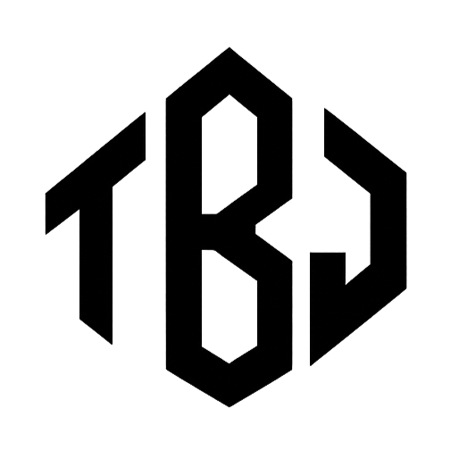

<div align="center">

<picture>
  <source media="(prefers-color-scheme: dark)" srcset="public/tbj-white-logo.png">
  
</picture>

# The Brian Journal

**A personal blog by [Brian Castelino](https://github.com/bcastelino)** — writing about technology, building things, and various topics.

[](https://bcastelino.github.io/blogs/)
[](https://github.com/bcastelino/blogs/actions/workflows/deploy.yml)
[](./LICENSE)


</div>

---

<div align="center">

> ### *"An editorial-style journal for engineer's deep dives, build logs, and notes on shipping things."*

</div>

## 📰 What's inside

<table>
<tr>
<td width="50%" valign="top">

**🧠 Deep technical writing**
Long-form posts on data, AI, and the craft of building — from summit recaps to build-your-own guides.

**🎨 An editorial reading experience**
A masthead, "on this page" navigation, live reading progress, and a sticky title bar — like a proper magazine.

**🌗 Light & dark, no flash**
An OKLCH design-token system that respects your system theme and remembers your choice.

</td>
<td width="50%" valign="top">

**📊 Diagrams that render themselves**
Drop a `mermaid` code block into any post and it becomes an interactive diagram.

**📱 Reads great everywhere**
Verified responsive from 320px phones through tablets to desktop — nothing overflows.

**⚡ Static & instant**
Fully pre-rendered with Next.js, served from GitHub Pages. No server, no database, no cold starts.

</td>
</tr>
</table>

## 🧭 On the shelf

Recent and recurring themes from **The Brian Journal**:

`Data + AI` · `Databricks & the Lakehouse` · `Agentic systems` · `Building in the open` · `Static sites & the web platform` · `Developer tooling`

## 🎨 Crafted with

| | |
| --- | --- |
| **Framework** | Next.js 15 (App Router, static export) |
| **UI** | React 19 · CSS Modules · OKLCH design tokens |
| **Type** | Geist + Geist Mono via `next/font` |
| **Content** | Markdown via `remark`, `remark-gfm`, `remark-html`, `gray-matter` |
| **Diagrams** | Mermaid 11 + `@mermaid-js/layout-elk` |
| **Hosting** | GitHub Pages + GitHub Actions |

## �️ Want to run or fork it?

This repo is the full source of the site. If you'd like to run it locally, write posts,
or deploy your own copy, the complete reproduction guide lives in **[`SETUP.md`](./SETUP.md)**.

```bash
npm install && npm run dev   # → http://localhost:3000
```

---

<div align="center">

**The Brian Journal** - by [Brian Castelino](https://www.linkedin.com/in/cas7elino/)

Code released under the [**MIT License**](./LICENSE) · Content (blog posts) © Brian Castelino

[Live Site](https://bcastelino.github.io/blogs/) · [GitHub](https://github.com/bcastelino) · [Setup Guide](./SETUP.md)

</div>
