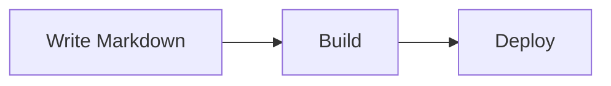

# Setup & Reproduction Guide

Everything you need to run **The Brian Journal** locally, write content, build the
static site, and deploy your own copy to GitHub Pages.

> Looking for the project overview instead? See [`README.md`](./README.md).

---

## 1. Prerequisites

| Tool | Version | Notes |
| --- | --- | --- |
| **Node.js** | **20.x** (18.18+ works) | CI builds on Node 20 — match it to reproduce exactly. |
| **npm** | 10+ | Ships with Node 20. |
| **Git** | any recent | For cloning and deploying. |

Check your versions:

```bash
node -v
npm -v
```

---

## 2. Clone & install

```bash
git clone https://github.com/bcastelino/blogs.git
cd blogs
npm install
```

---

## 3. Run the dev server

```bash
npm run dev
```

Open <http://localhost:3000>.

- In **development** there is **no `/blogs` base path** — the site is served from `/`.
- The `/blogs` base path is applied **only in production builds** (see [Deploying](#6-deploy-to-github-pages)).

---

## 4. Write a post

Create a Markdown file in `content/posts/`. The file name becomes the URL slug
(e.g. `content/posts/my-post.md` → `/blogs/blog/my-post/`).

Add frontmatter at the top:

```md
---
title: My Post Title
date: 2026-06-24
excerpt: A one-line summary shown on the home page and used for SEO.
tags: [topic, another]
---

Your content in **Markdown**.
```

### Supported frontmatter

| Field | Required | Notes |
| --- | --- | --- |
| `title` | recommended | Falls back to the slug if omitted. |
| `date` | recommended | ISO date; drives ordering and the "published" meta. |
| `excerpt` | recommended | Shown on the home page and used as the meta description. |
| `tags` | optional | Array of topic tags. |
| `author` / `authorUrl` | optional | Defaults to Brian Castelino. |
| `updated` | optional | Shows an "Updated" date when different from `date`. |
| `faq` | optional | Array of `{ question, answer }` — renders an FAQ block + FAQ schema. |

### Mermaid diagrams

Embed a fenced ` ```mermaid ` block in any post and it renders client-side:

````md

````

---

## 5. Build & preview the static export

```bash
npm run build      # outputs the static site to ./out
npx serve out      # optional: preview the production build locally
```

`npm run build` runs `next build` with `output: 'export'`, producing a fully static
site in `./out` — no server required to host it.

---

## 6. Deploy to GitHub Pages

1. Create a GitHub repo named **`blogs`** and push this project to the `main` branch.
2. In the repo, go to **Settings → Pages → Build and deployment** and set
   **Source** to **GitHub Actions**.
3. Every push to `main` triggers [`.github/workflows/deploy.yml`](./.github/workflows/deploy.yml),
   which installs dependencies (`npm ci`), builds the static export, and publishes
   `./out`. The site goes live at `https://<your-username>.github.io/blogs/`.

> **Renaming the repo?** The `basePath`/`assetPrefix` in
> [`next.config.mjs`](./next.config.mjs) are set to `/blogs` to match the repo name.
> Update the `repo` constant there if you use a different name.

---

## 7. Project structure

```text
app/                       App Router pages
  page.js                  Home (masthead + latest + archive)
  about/                   About page
  writing/                 "Writing" docs page (Markdown reference)
  blog/[slug]/             Individual blog posts
  layout.js                Root layout, Nav + Footer, theme script
  globals.css              Design tokens + prose styles
components/                Nav, Footer, ThemeToggle, ReadingChrome,
                           KeepReading, MermaidRenderer, PostCard, ... (CSS Modules)
content/posts/             Markdown blog posts
content/writing/           Markdown for the /writing docs page
lib/posts.js               Markdown loading, rendering, TOC + reading time
public/                    Static assets (brand logos); app icons live in app/
.github/workflows/         GitHub Actions deploy pipeline
next.config.mjs            Static export + basePath config
```

---

## 8. Verifying a change (optional)

A couple of checks worth running after edits, since the site is static and
content-driven:

- **Responsive check** — the layout is verified to have zero horizontal overflow
  from **320px** through tablet and desktop widths. When touching layout/CSS, resize
  the browser (or use device emulation) across 320 / 375 / 768 / 1024 / 1440px and
  confirm nothing overflows.
- **Hydration** — post bodies are injected via `dangerouslySetInnerHTML` from
  build-time Markdown and are marked `suppressHydrationWarning`, since the HTML is
  server-authoritative. If you add client interactivity, avoid non-deterministic
  values (`Date.now()`, `Math.random()`) during render.

---

## Common commands

| Command | What it does |
| --- | --- |
| `npm run dev` | Start the local dev server on port 3000. |
| `npm run build` | Build the static site into `./out`. |
| `npm run start` | Serve a non-exported production build (rarely needed here). |
| `npm run lint` | Run Next.js/ESLint checks. |
| `npx serve out` | Preview the exported static site locally. |
