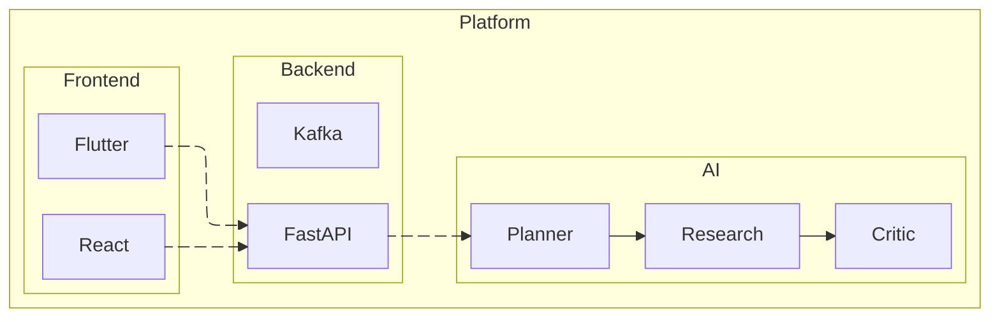

## What Markdown supports

This page is itself written in Markdown and rendered through the same pipeline used by blog posts.

## Headings

Sections are automatically given anchor IDs so they can be linked directly.

### Heading 3

#### Heading 4

##### Heading 5

###### Heading 6

## Paragraphs and emphasis

A paragraph can contain **bold text**, *italic text*, and ***bold italic text***. You can also mark things with ~~strikethrough~~ or inline code like `const answer = 42`.

## Links

Here is a [link to the home page](/) and an [external link](https://nextjs.org).

## Images


## Lists

### Unordered

- First item
- Second item
  - Nested item
  - Another nested item
- Third item

### Ordered

1. Install the dependencies
2. Write the post
3. Commit and push

### Alphabetical

Markdown does not have a native lettered-list syntax, but the HTML it passes through is rendered:

<ol type="A">
  <li>First option</li>
  <li>Second option</li>
  <li>Third option</li>
</ol>

## Blockquotes

> A blockquote draws attention to a quoted idea or note. It can contain **formatting** and `code` too.

## Code blocks

```js
function greet(name) {
  return `Hello, ${name}!`;
}
```

## Tables

| Feature | Status | Notes |
| --- | --- | --- |
| Headings | Supported | Auto-anchored H2/H3 |
| Tables | Supported | Via remark-gfm |
| Code blocks | Supported | No syntax highlighting by default |

## Task lists

- [x] Create a Markdown demo file
- [ ] Add Mermaid diagram support
- [ ] Add LaTeX math support

## Footnotes

A sentence can reference a footnote[^1].

[^1]: This is the footnote text. It appears at the bottom of the rendered section.

## Mermaid Diagrams



## Horizontal rule

---
